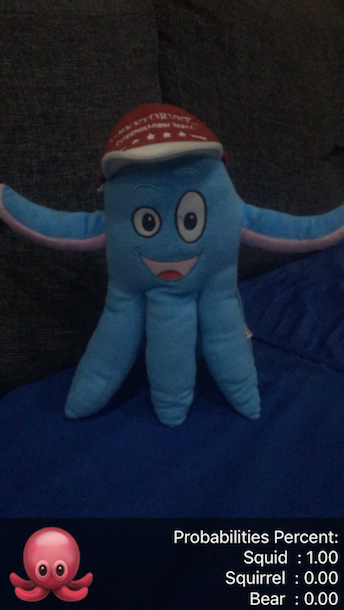
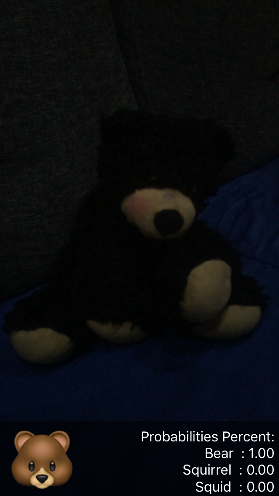

# Machine learning Core ML Models

As iOS 11 was released this gave the developers options to integrate trained ML models into their applications directly. *Core ML* processes the input, for example of an image and then use the mlmodel to predict the result based labels.
This project we used 3 different plush animals for predicting which animal we currently are seeing, using the *ARKIT*. For training process I used *Microsoft Custom Vision AI* for creating the trained mlmodel, which is free to use. 

## Steps for Creating the Machine Learning Model:
1. Take several pictures in different angles of the object/objects
2. Save the stored images in different folders, e.g. all images of a bear in a folder etc.
3. Now that we have all images, we start the training by creating firstly a Microsoft account and then log in
4. Create a new account and put one folder with each same object images with the tag
5. After have added all images, we start the training and later export the .mlmodel file and insert it into xcode project

## References:

1. Microsoft Custom Vision for Creating mlmodel:
https://www.customvision.ai

